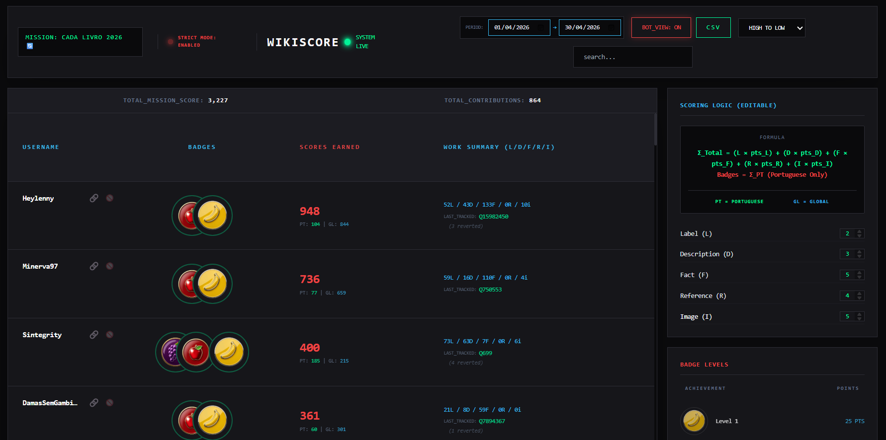
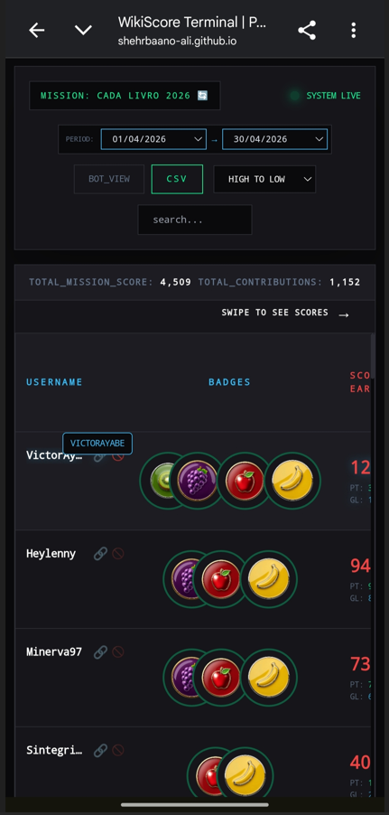

# Shehrbano Ali - WikiScore-Lusofonia (Wish #8)

**Name:** Shehrbano Ali  
**Email:** shehrbanoali2230@gmail.com  
**Github:** [Shehrbaano-Ali](https://github.com/Shehrbaano-Ali/)  
**Program:** Outreachy 2026 Cohort  
**Project:** Addressing the Lusophone technological wishlist proposals  
**Date:** April 19th, 2026  
**Wish #8:** [Proposta para a Lista de Desejos nº 8 - Criar uma ferramenta para contar as edições do Wikidata em português](https://meta.wikimedia.org/wiki/Lista_de_desejos_tecnol%C3%B3gicos_da_lusofonia/2025/Propostas/Ferramenta_de_pontua%C3%A7%C3%A3o_para_edi%C3%A7%C3%B5es_no_Wikidata)


---
## LINK

### 🌐 [Click here to view the Live WikiScore](https://shehrbaano-ali.github.io/WikiScore-Lusofonia-Wish-8-/)

---
## 📸 Visual Overview

### 1. Visual representation of Wikiscore on Laptop💻




### 2. On Phone📱



---
## Table of Contents

- [Introduction](#introduction)
- [Objectives](#objectives)
- [Technical Steps & Implementation](#technical-steps--implementation)
- [📱Mobile Adaptation & UX Polishing](#mobile-adaptation--ux-polishing)
- [API & Retrieval (RAG Principles)](#api--retrieval-rag-principles)
- [Speed & Traffic Control (Parallel Processing)](#speed--traffic-control-parallel-processing)
- [The Professional Organizer Tools](#the-professional-organizer-tools)
- [Python & Django Logic](#python--django-logic)
- [Note](#note)
- [Repository Structure](#repository-structure)
- [AI Usage](#ai-usage)
---
## Introduction
I built WikiScore-Lusofonia to address a major gap in how the Portuguese-speaking community tracks Wikidata contributions. Current methods were less systematic; organizers needed a tool that was fast, precise, and focused on language-specific effort.

I built this prototype from scratch to be a full-stack answer. It features a real-time JavaScript terminal for organizers and a Python/Django backend for the official Wikimedia servers.


---
## Objectives
1. For the *Precision* model will automatically identify and score Portuguese edits `(|pt)`.  
2. Use a `Bot-Shield` and `Revert-Validator` to ensure only authentic work counts.  
3. For *High Performance* use parallel processing to scan 100+ participants in seconds.  
4. For *Permanent Storage* use SQL-based models so contest data is never lost.  
5. For the *Healthy Competition* use a badge-based ranking system.

---
## Technical Steps & Implementation
**1. The SQL and Newcomers:**  
In my code, this is handled by models.py. For people new to coding, data usually disappears when you refresh a page. I used Django Models to create a permanent SQL Database. This means when a new person joins a contest, their name and points are saved forever on the server, not just for one session.

**2. The Proxy:**  
I used const PROXY = `*https://corsproxy.io/?*`;. Sometimes websites block outside code from talking to them. I used this CORS Proxy to act as a middleman so my app can talk to Wikidata smoothly without any blockages.

**3. Time/Dates:**  
I didn't just hardcode a single date. I built a Time Machine feature using dateRange and updateDates(). Organizers can pick exactly when a contest starts and ends using the date inputs in the header, and the engine will only count edits from that specific time.

**4. The Point Breakdown:**  
I broke down a user's work into 5 specific categories: `*Labels (L), Descriptions (D), Facts (F), References (R), and Images (I)*`. Every time a user makes an edit, the engine identifies exactly what they did and gives them the right amount of points based on my custom weights.

**5. Healthy Competition *(Badges):***  
I used badgeRules and renderLegend to create a *Ranking System* from `Level 1 to Level 6`. These aren't just pictures; I created these badges to make editors feel like they are leveling up in a game. It turns a boring task into a fun, healthy competition.

---

## 📱Mobile Adaptation & UX Polishing
A professional tool must be accessible. I implemented specific mobile-first logic to ensure the terminal remains functional on small screens:  

1. Implemented a swipeable table logicnthat keeps the data-heavy leaderboard readable on mobile without squishing columns.
2. I created a *Swipe to see scores* hint that only appears on mobile.
3. Since mobile devices lack hover states, I built a custom `showNameTooltip` function. When a truncated username is tapped, a subtle terminal-style popup appears to show the full ID before fading away.
4. Utilized Tailwind md: prefixes to ensure the layout snaps from a tight mobile view to a wide, balanced desktop sequence automatically.

---
## API & Retrieval (RAG Principles)
In my code, this lives in `harvestData` and `fetchScore`. I used the core principles of Data Retrieval that is the same logic used in RAG (Retrieval-Augmented Generation) systems to build a high performance API engine that pulls authentic data from Wikidata.  
My app *retrieves* raw, authentic data directly from the Wikidata API, behaving like a specialized search engine that only looks for contest data.

---
## Speed & Traffic Control (Parallel Processing)
Scanning 100 users one by one takes forever. I set the `CONCURRENCY_LIMIT = 20 `. This means the app scans 20 users at the same time. To prevent traffic jams (crashing the API), I added **throttling** so it only handles a safe amount of data at once.  
Every new edit found will show up in the frontend in real-time.


---
## The Professional Organizer Tools  

I added three critical tools that make this a professional system for organizers:

**1.** A button *Export to CSV* turns the leaderboard into a file so organizers can report results to the Wikimedia Foundation easily.  
**2.** A *Bot-Shield* is a security guard that checks `e.hasOwnProperty('bot')` and ignores automated edits to keep the data authentic.  
**3.** A *Disqualify* (🚫) button. If someone is cheating, the organizer can *gray them out* and remove their points with one click.  
**4.** I added direct links to the raw data. If an organizer wants to check a score, they can touch the chain icon and see the user's actual Wikidata contributions instantly.

---

## Python & Django Logic

I designed the backend logic to integrate seamlessly into the existing WikiScore environment without requiring structural rewrites.

1. **`models.py`:** Unlike generic implementations, I used `BigIntegerField` for revision IDs to prevent system crashes as Wikidata grows.
   It includes an **Audit Trail** (storing the raw `comment`) and **Item Tracking** (storing the specific `QID`), ensuring 100% transparency if a score is disputed.
3. **`logic.py`:** Packaged as a standard **Django Management Command**. It can be added to the existing `update.py` pipeline with a single line. 
4. Specifically for Wish #8, my regex engine `r'\|pt(-br)?'` is designed to detect both **Portuguese (pt)** and **Brazilian Portuguese (pt-br)** edits. This ensures no Lusophone editor is left behind.
5. I implemented a `WikidataPointRule` model and contest-level switches (`wikidata_enabled`, `wikidata_exclude_bots`, `wikidata_linked_only`) so organizers can customize the strictness of the contest from the Django Admin panel.
6. Once stored, points are added to the grand total via a one-line update to the `CounterHandler` method:
   `wikidata_points = sum(edit.points for edit in WikidataContribution.objects.filter(participant=user, is_portuguese=True))`


```
Question:
How to use it in the existing system? 

Answer:
Because `logic.py` is built as a management command, maintainers can plug it directly into the current update pipeline.
They can simply add `load_wikidata` to the existing `update.py` sequence (right alongside `load_edits` and `load_users`).  
* The engine will wake up  
* Read the active contests  
* Fetch the Wikidata contributions  
* Filter out the bots  
* Log the scores directly into the database
```
---

## Note
*Organizers can make the competition tough by changing the points on badges in the UI, because I made the system fully editable.*  

`I hope this prototype demonstrates my technical potential. I would appreciate more direct access to the Outreachy Dashboard systems in the future so I can build tools that run even smoother, without any API or caching blockages.`

---

## Repository Structure
```
WikiScore-Lusofonia-Wish-8/
│
├── django-logic/      # Backend Python & Django files
    ├── models.py      # SQL Database Structure
│   └── logic.py       # Python Scoring Engine
├── LICENSE            # MIT License 
├── README.md          # Technical documentation (this file)
├── app.js             # Core scoring engine & API integration
├── badge_50.jpg       # Achievement asset: Level 1 
├── badge_200.jpg      # Achievement asset: Level 2
├── badge_500.jpg      # Achievement asset: Level 3 
├── badge_1000.png     # Achievement asset: Level 4  
├── badge_2000.png     # Achievement asset: Level 5 
├── badge_3000.png     # Achievement asset: Level 6
├── index.html         # Terminal UI structure & Organizer dashboard
├── my-prototype.png   # Full visual preview of the tool on laptop
├── my-prototype-mobile.png   # Full visual preview of the tool on Phone
└── style.css          # Terminal aesthetic, animations & neon styling
```

---
## AI Usage
I utilized Gemini for:
* Organizing this README to reflect my scratch to the end analysis.
* Working through responsive CSS edge cases to ensure the sequence remained perfect on both laptop and mobile.

All code, logic (PT vs GL split), and the Cache Buster fix were manually verified and implemented by me. I want to allow myself smooth reach to the Outreachy dashboard for my future work without any blockage.

---

*Here is the link to my _**[Blog]()**_*  
*This work is submitted for the Outreachy 2026 internship application for the Wikimedia Project.*  
*~Shehrbano Ali*
